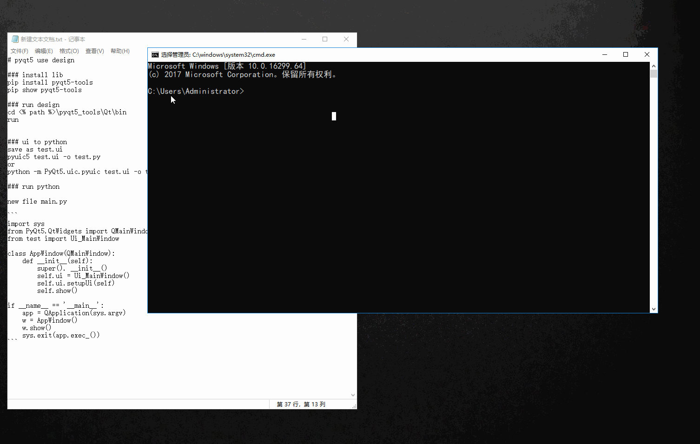

# pyqt5 use design



### install lib

```
pip install pyqt5-tools
pip show pyqt5-tools
```

### run design
cd <% path %>\pyqt5_tools\Qt\bin
run design.exe


### ui to python
save as test.ui

`pyuic5 test.ui -o test.py `
or
`python -m PyQt5.uic.pyuic test.ui -o test.py`

### run python

new file main.py

```
import sys
from PyQt5.QtWidgets import QMainWindow, QApplication
from test import Ui_MainWindow

class AppWindow(QMainWindow):
    def __init__(self):
        super(). __init__()
        self.ui = Ui_MainWindow()
        self.ui.setupUi(self)
        self.show()

if __name__ == '__main__':
    app = QApplication(sys.argv)
    w = AppWindow()
    w.show()
    sys.exit(app.exec_())
```